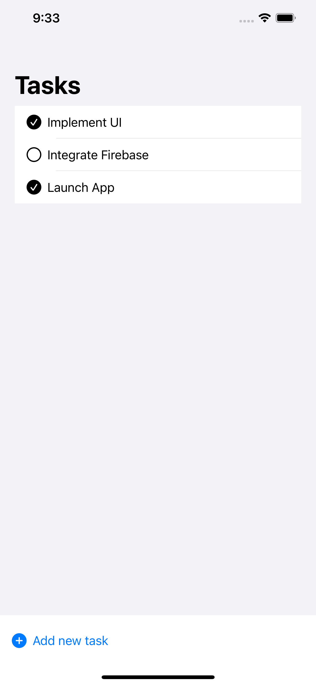
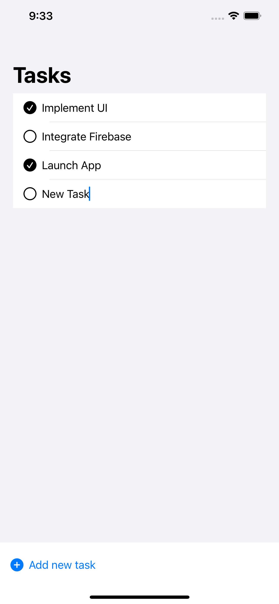

# FireTask :tada: :rocket:
Simple **ToDO** app made using SwiftUI and firebase

# Features :muscle:

- User can add task
- User can edit task
- User can mark task complete

## App UI
**App Screens** 

Made with with **SwiftUI**